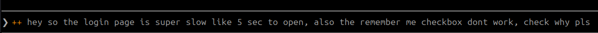
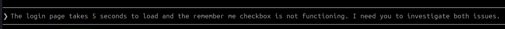
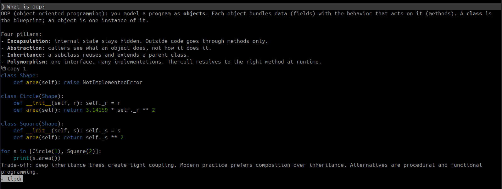
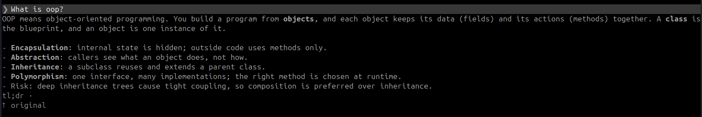
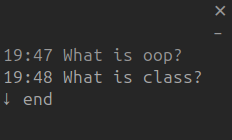

# claude-mods

Three small mods for [Claude Code](https://code.claude.com/docs/en/plugins/mods/overview). Install the ones you want.

```bash
claude plugin marketplace add GururOzatmaca/claude-mods
claude plugin install prompt-boost@claude-mods
claude plugin install reply-tools@claude-mods
claude plugin install jump-list@claude-mods
```

Needs Claude Code 2.1.287 or newer. If the install says `options not yet set`, ignore it; the defaults work.

## prompt-boost

Add `++` to a messy prompt. It gets rewritten in clear English and put back in the box. You check it, then press Enter.




- `++` at the start or end. `++o` uses Opus, `++q` adds open questions.
- Only the wording changes. Names, paths and errors stay exactly as you wrote them.
- `/ap undo` brings back your original.

## reply-tools

A copy button on every code block, and a `tl;dr` button under long replies.




- `⧉ copy all` copies several shell commands at once.
- `tl;dr` keeps every step and warning. `↑ original` switches back.
- Turn parts off with `/plugin configure reply-tools@claude-mods`.

## jump-list

A side list of every prompt in the session, with its time. Click one to jump back.



- `↓ end` goes to the bottom. `–` folds it into one line.
- Works after resume too. Open it with `/jumps`.
- Needs the fullscreen layout. A very old prompt may need a second click.

## Good to know

Mods run with your permissions. prompt-boost and tl;dr make one model call each time you use them. jump-list reads the session's transcript file. Run `claude plugin validate <folder>` to see exactly what a mod does.

MIT license.
